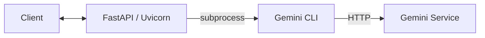

# Gemini CLI Backend (PoC)

Wrap **Gemini CLI** behind a **FastAPI** service and expose minimal REST endpoints (incl. BMAD method scaffolds). Containerized for local dev via Docker Compose.

> ⚠️ This is a PoC. Gemini CLI is currently in preview and its flags may change. Use sandboxing and never commit secrets.

---

## Features

* **/chat/stream** – Streamed responses from Gemini CLI (non‑interactive `-p` mode).
* **BMAD endpoints** – `/bmad/brief`, `/bmad/arch`, `/bmad/tasks`, `/bmad/deliver` with simple prompt templates.
* **Dockerized** – No host installation of Node/Python required beyond Docker.
* **KISS** – Minimal deps: FastAPI + Uvicorn.

---

## Architecture (PoC)



* **API layer**: FastAPI exposes endpoints and invokes the CLI as a subprocess.
* **CLI**: `gemini -p <prompt>` non‑interactive execution to avoid stdin blocking.

---

## Prerequisites

* Docker & Docker Compose
* A valid **Gemini API key** (recommended for PoC)

> You don’t need Node on the **host**; the image installs Node & Gemini CLI inside the container.

---

## Quickstart

1. **Clone & enter**

```bash
git clone <your-repo-url> gemini-cli-backend
cd gemini-cli-backend
```

2. **Create `.env`** (pick ONE mode)

### A) Pure Gemini API (recommended)

```
GEMINI_API_KEY=YOUR_API_KEY
```

### B) Vertex or GCA (optional; choose one)

```
GOOGLE_API_KEY=YOUR_API_KEY
# EITHER of the following flags (not both):
GOOGLE_GENAI_USE_VERTEXAI=true
# or
# GOOGLE_GENAI_USE_GCA=true
```

> If you previously used `GOOGLE_API_KEY` without the Vertex/GCA flag, switch to `GEMINI_API_KEY`.

3. **Build & run**

```bash
docker compose build
docker compose up -d
```

4. **Smoke tests**

OpenAPI spec:

```bash
curl -s http://localhost:8000/openapi.json | head
```

Streamed chat:

```bash
curl -N http://localhost:8000/chat/stream \
  -H "Content-Type: application/json" \
  -d '{"prompt":"寫一首關於新竹風天的短詩"}'
```

---

## Endpoints

### `POST /chat/stream`

Request body:

```json
{ "prompt": "..." }
```

Response: streamed text (newline‑delimited). In this PoC we call `gemini -p <prompt>` and stream stdout.

### `POST /bmad/brief`

```json
{ "goal": "build a small task app ..." }
```

Returns: model output (JSON string if your CLI supports JSON; otherwise plain text). See **Troubleshooting**.

### `POST /bmad/arch`

```json
{ "prd": "<the PRD JSON or text>" }
```

### `POST /bmad/tasks`

```json
{ "arch": "<the architecture JSON or text>" }
```

### `POST /bmad/deliver`

```json
{ "plan": "<the plan JSON or text>" }
```

> You can inspect `/docs` (Swagger UI) for live testing.

---

## Project Layout

```
.
├─ app/
│  ├─ app.py                 # FastAPI app & routes
│  ├─ bmad_prompts/
│  │  ├─ brief.md
│  │  ├─ arch.md
│  │  ├─ tasks.md
│  │  └─ deliver.md
│  └─ requirements.txt
├─ Dockerfile                # Installs Node, Gemini CLI, Python deps
├─ docker-compose.yml        # Injects .env, exposes 8000
└─ README.md                 # This file
```

---

## Implementation Notes

* **Streaming**: use non‑interactive CLI (`gemini -p <prompt>`) to avoid stdin flush issues. STDERR is merged into STDOUT so you can see errors in the stream.
* **BMAD**: prompt templates live in `app/bmad_prompts/`. The helper currently expects JSON if your CLI exposes such an option; if not, parse text.
* **Rebuilds**: since `app/` is baked into the image, code changes require `docker compose build && docker compose up -d`.

---

## Troubleshooting

**Symptom:** `Please set an Auth method ...`

* **Cause:** container didn’t receive a valid auth env.
* **Fix:** ensure `.env` contains `GEMINI_API_KEY` **or** `GOOGLE_API_KEY` + one of `GOOGLE_GENAI_USE_VERTEXAI=true` / `GOOGLE_GENAI_USE_GCA=true`.
* Verify within the running container:

```bash
docker compose exec api env | grep -E 'GEMINI_API_KEY|GOOGLE_GENAI_USE'
```

**Symptom:** `Unknown argument: json` (and CLI usage text)

* **Cause:** your installed Gemini CLI version doesn’t support `--json`.
* **Fix:** remove `--json` from any subprocess calls (we already removed it for `/chat/stream`). For BMAD handlers, either upgrade CLI to a version that supports JSON output or parse plain text.

**Symptom:** `Recv failure: Connection reset by peer`

* **Cause:** CLI subprocess exited immediately (usually auth/flag mismatch) and the stream closed.
* **Fix:** same as above; also tail logs during requests:

```bash
docker compose logs -f api
```

**Symptom:** 200 OK but no streamed content

* **Cause:** stdout buffering or CLI usage error.
* **Fix:** use non‑interactive `-p` mode, merge stderr to stdout (done), or switch to SSE framing (see Roadmap).

---

## Security Notes

* **Never** commit `.env` or API keys. Rotate keys if a key has been exposed in a shell history or log.
* Run the container with a read‑only filesystem and strict volume allow‑lists if you enable tools/agents later.
* Keep `YOLO`/auto‑approve flags **off** in multi‑tenant or exposed environments.

---

## Roadmap (nice‑to‑have)

* **SSE** (`text/event-stream`) for smoother streaming.
* **Pydantic schemas** to validate BMAD JSON and auto‑repair invalid outputs.
* **Process pool** + a small queue for better concurrency.
* **Healthz** route & container healthcheck.
* **Observability**: request IDs, basic metrics, structured logs.

---

## Git Hygiene

Add a `.gitignore` before pushing:

```
# Python
__pycache__/
*.pyc

# Node (safety)
node_modules/

# Env & local configs
.env
.env.*
*.log

# Docker
*.local.yml
```

Initialize & push:

```bash
git init
git add .
git commit -m "feat: PoC FastAPI wrapper for Gemini CLI (+BMAD)"
# Create repo on GitHub first, then:
git remote add origin git@github.com:<you>/gemini-cli-backend.git
git branch -M main
git push -u origin main
```

---

## License

MIT (or choose one). Update this section accordingly.

---

## Acknowledgements

* Gemini CLI team (preview)
* FastAPI & Uvicorn communities
